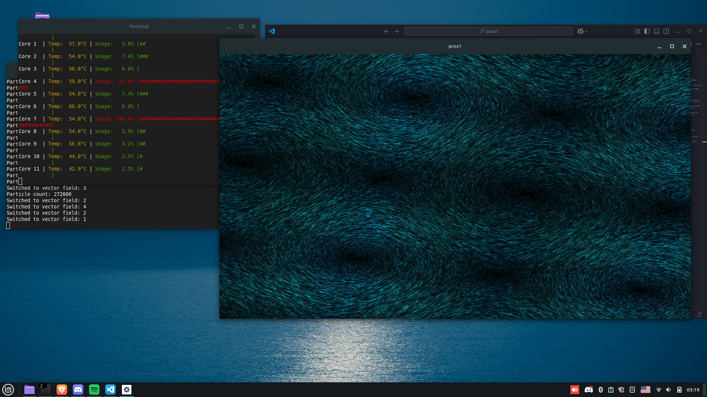

# prox1
Vector fields implemented in C with OpenGL and RGFW

## Showcase

## Structure
Because of the bigger than most of my C projects structure i use ./src folder and build it with Makefile.
All configuration lays in config.ini

## To fix (Issues)
- A lot of rendering problems cuz i dont know how to use OpenGL properly
- I am also pretty sure i fucked up the particle system redistribution and all