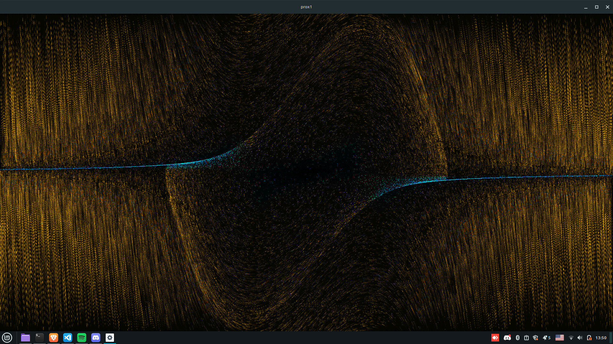
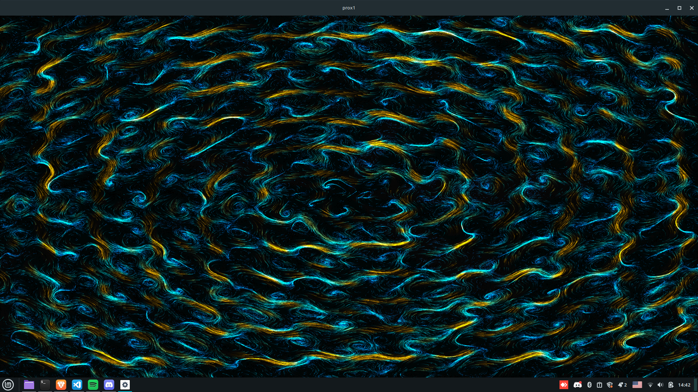

# prox1
Vector fields implemented in C with OpenGL and RGFW

## Structure
All configuration lays in config.ini

## Data flow
```txt
User Input → Camera → Particles → Vector Field → Integration → Renderer
     ↓                    ↑             ↓
   Config  ←──────────────┴─────────────┘
```

## To fix / implement (Issues)
- New input system for more fields support

## Showcase


